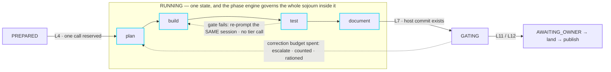
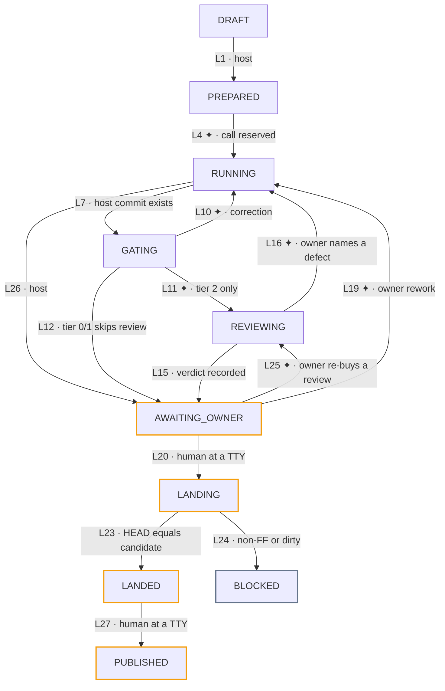

# AWSF — Agentic Workflow Software Factory

[](https://github.com/santiagoms2404/agentic-workflow-software-factory/actions/workflows/ci.yml)

A single-operator software factory for AI coding agents. A host-owned state
machine governs a task's lifecycle, a typed phase engine governs the work inside
each executing state, and a human at a terminal is the only path to landed code.

**The problem it solves.** An agent that can edit files can also commit them,
push them, spawn more agents, and report a success it did not earn. Each of
those is a state change, and a model asked to check whether its own state change
is permitted is not a control. AWSF moves every one of them out of the model's
reach: **the model supplies structured facts, the host advances state, and a
human authorises anything that becomes permanent.**

> **Status: pre-alpha, single operator, actively built.** v1 is complete —
> M0–M11, 38 tasks, both adoption pilots landed on real work. **v2 is the
> current workstream**: seventeen workstreams on a spine plan, nine landed, each
> milestone carrying its own deep plan with its own tickets, amendments and
> validation. The factory has driven 44 real sessions on this repository and
> landed 8 of them. No native-Windows write parity is claimed. Every number on
> this page is reproduced by a command in
> [Verifying these claims](#verifying-these-claims).

## Run it without an API key

The orchestrator runs against captured provider fixtures, so the whole lifecycle
is exercisable with no account, no key and no quota spent:

```bash
npm install
npm test                                    # 2,167 tests, four layers
npm run awsf -- new T01-fixture "describe the task" --workflow simple-sdlc --tier 1
npm run awsf -- start T01-fixture --stub true
npm run awsf -- run T01-fixture --stub true
npm run awsf -- status T01-fixture
```

That drives the full `simple-sdlc` recipe — plan → build → tests → document →
final tests → review — through the real state machine, the real gates, the real
append-only journal and the real SQLite projection. Only the provider process is
a fixture.

## Verified numbers

| What | Value | Where it lives |
|---|---|---|
| Task lifecycle | 11 states, 27 legal edges, 94 rejected ordered pairs of the 121-pair matrix | [`core/src/state/task-machine.ts`](core/src/state/task-machine.ts) |
| Phase submachine | 8 states, with a same-session correction loop | [`core/src/state/phase-machine.ts`](core/src/state/phase-machine.ts) |
| Postcondition gates | 20 | [`core/src/gates/interface.ts`](core/src/gates/interface.ts) |
| Tests | 2,167 across 4 layers — unit 1,815 · contract 95 · simulation 84 · journeys 173 | `core/test/` |
| Architecture fences | 33 meta-tests that fail the build when a boundary is crossed | [`core/test/unit/meta/`](core/test/unit/meta) |
| Owner CLI | 27 commands | `CLI_COMMANDS` in [`core/src/cli/main.ts`](core/src/cli/main.ts) |
| Workflows | 8 recipes | [`core/src/workflow/recipes/`](core/src/workflow/recipes) |
| Provider adapters | 3 real + 1 fixture stub | [`core/src/adapters/catalog.ts`](core/src/adapters/catalog.ts) |
| Process supervision | 1 port, 3 OS implementations, 1 shared contract suite | [`core/src/execution/platform/`](core/src/execution/platform) |
| HTTP API | 8 reads + 1 archive write | [`core/src/api/routes.ts`](core/src/api/routes.ts) |
| Plans | 16 plan documents carrying **189 dated amendment entries** | [`specs/`](specs) |
| Real runs on this repo | 44 sessions · 137 transitions · 228 phases · 508 gate results · 8.07M tokens · 84 provider calls | the journal and its projection |

## What this is

AWSF fuses two systems that each solved the problem the other ignored:

- **`my-agentic-workflow` (MAW)** owns the *task lifecycle* — guarded state
  transitions, a PID-before-spawn barrier that makes hidden processes
  structurally impossible, and a human-only landing edge. It has no idea what
  happens *inside* a running task.
- **`super-simple-software-factory` (SSSF)** owns the *work inside a single
  execution* — typed phases, runtime-validated envelopes, postcondition gates
  with same-session correction loops, and a live SQLite trace. It has no idea
  what a task *is*.

The fusion is one sentence: **the state machine governs the task; the phase
engine governs the sojourn inside the executing states.** A gate failure inside
a phase is corrected cheaply — re-prompt the same provider session, context
intact, nothing charged against the task's call budget. Only when a phase's own
correction budget is exhausted does the failure escalate to a *state
transition*, which is expensive, reserved in advance, and rationed by a risk
tier ceiling.



Cyan is the cheap loop: a correction inside a phase re-prompts the same provider
session with its context intact and costs nothing against the task's budget.
Violet is the expensive one: escalating to a state transition is counted against
the tier ceiling, reserved before it happens, and has to produce evidence.

### Six pillars

1. **Host owns the loop.** No model selects phases, changes risk tier, advances
   lifecycle state, lands code, or repairs orchestration state.
2. **Journal is truth; SQLite is a rebuildable projection.** Delete the database
   and `awsf db rebuild` reconstructs it byte-identically.
3. **No process before registration.** The launcher blocks until the journal,
   status store and projection all acknowledge a spawned process's identity.
4. **Typed envelopes and earned success.** Every phase is constructed
   `FAILED`-equivalent; every agent output is schema-validated at runtime; a
   green gate records *what it verified*, not merely that it passed.
5. **Host owns Git; humans own landing.** Agents edit, never commit, merge or
   push. Landing is a local fast-forward only, from an interactive TTY, through
   a persisted `LANDING` state. **Exactly one push path exists in the whole
   codebase** — `awsf publish`, a separate human act on an already-landed
   revision, authorised by the ordered truth table in
   [`core/src/publish/authorize.ts`](core/src/publish/authorize.ts) and spelled
   as argv in [`core/src/publish/argv.ts`](core/src/publish/argv.ts) and nowhere
   else. No pre-`LANDED` push, no force-push and no remote-branch deletion path
   exists anywhere, and the `publish-fence` and `no-destructive-paths`
   meta-tests are what keep that true.
6. **Portability is a contract, not a hope.** One `ProcessSupervisor` port,
   three platform implementations, one shared contract suite — a port that
   cannot enumerate survivors errors, it never silently returns `[]`.

## The lifecycle

Eleven states, twenty-seven legal edges, ninety-four rejected pairs evaluated
against an eleven-step ordered rejection contract. The rejection *order* is part
of the contract: a refusal must name the real defect, or fixing what it named
would let an illegitimate transition through.



`awsf new` creates the task at `DRAFT`. Four things the diagram deliberately
leaves out, because drawing them would mean an edge from every node:

- **`BLOCKED`** is reachable from every active state, by an explicit host reason
  code and **never by a clock** — a timer is not among the deterministic reason
  sources. `awsf retry` mints attempt n+1 back at `DRAFT`.
- **`CANCELLED`** is reachable from every active state by explicit human cancel.
- **✦ marks a spawn site**, legal only on edges into `RUNNING` or `REVIEWING`.
- Any other route into `LANDED` throws `HumanGateBypass`.

Amber nodes are the ones only a human can move into or out of.

All 27 legal edges, all 94 rejected pairs and the ordered rejection contract are
green in the suite. `LANDED` and `PUBLISHED` are reachable only through a human
at an interactive terminal. Of the 137 transitions in this repository's current
projection, 129 were taken by the host and 8 by a human — and every one of those
eight is owner re-entry: seven reworks and one replacement review.

## marimba — the driving layer

AWSF is a CLI. Something still has to decide *which* command to run, read what
came back, and hand the owner what a decision needs. That job is **marimba**:
an agent session in the driving role, sitting one tier above the factory.

**marimba never does the work.** It does not implement a task, does not edit a
managed worktree, and does not hand-edit anything under the state root. Workers
do that, inside attempts, under gates. marimba prepares, launches, observes,
records decisions and reports.

The first rule of the driving layer is the one that keeps it honest:

> **No skill is ever in the execution path.** No gate, transition, guard,
> reservation or accounting decision may depend on a driving document being read
> or followed. If one ever would, that is a defect in the CLI and it is fixed
> there.

So marimba is a judgment layer over a CLI that is already safe without it. Its
documents are thin and the CLI is fat, on purpose: every action marimba takes is
a command a human could type.

### The boundary

marimba runs with permission prompts turned off. What keeps it inside the
lifecycle is therefore not a prompt but a **per-invocation denial at the tool
surface**, delivered by a hook launched with marimba's own settings. Three
fences, defined once in
[`docs/driving/marimba/marimba-guard-rules.mts`](docs/driving/marimba/marimba-guard-rules.mts):

| Fence | What it denies | Why |
|---|---|---|
| **1 — delegation-shaped tool names** | Any tool whose normalised name contains one of 14 delegation stems (`agent`, `task`, `spawn`, `worktree`, `cron`, …) | A driving session must not start work the factory has no attempt directory, journal record, reserved call or gate for. Classification is by *shape*, not a fixed list, so a delegation tool that did not exist when the fence was written is denied on arrival. Ten observe-or-stop names are excluded by whole name; an MCP server's nouns are never classified. |
| **2 — owner-act command text** | A shell command invoking any of the 8 acts the lifecycle reserves for the owner: `land`, `cancel`, `rework`, `review`, `journey`, `raise`, `publish`, `resume` | `processOwnerTerminal()` checks `stdin.isTTY`, which is a terminal-*shape* test. A same-user agent with shell access can allocate a PTY and answer the confirmation, so the TTY check is not the boundary — this fence is. |
| **3 — lifecycle timeout metadata** | A finite timeout, as declared metadata or as a written `timeout` wrapper, around `run`, `rework`, `review` or `resume` | An external deadline on a lifecycle command kills a run mid-transition. |

If the payload parser cannot run at all, the guard **fails closed** and says so.

Fences 1 and 2 are shared by both supported harnesses; fence 3 is a pi-path
safety floor. The rules module imports nothing, a shell `PreToolUse` hook and a
pi extension both bind to it, and the suite asserts that the shell script's own
`for` loops still name exactly what the module exports — so editing one
harness's list without the other fails a test instead of silently producing two
different boundaries. The guard's behaviour is proven offline by a payload
matrix in [`core/test/unit/meta/`](core/test/unit/meta): 22 tests across
`marimba-guard.test.ts` and `marimba-guard-pi.test.ts`.

The repository holds the only copy of both scripts. The owner's settings point
at them by absolute path, so the file that is tested and the file that executes
are the same bytes and cannot drift apart.

### What the boundary does not cover

Stated plainly, because a fence whose limits are undocumented is a fence people
over-trust. Every item below was measured against the guard as committed, and
the full list lives in
[`docs/driving/marimba/CONTRACT.md`](docs/driving/marimba/CONTRACT.md) §3:

- Fence 2 reads **written command text, not resolved intent.** An act reached
  through a variable, a line continuation, or a quoted or split verb is not
  denied. Whitespace is the only shell transformation it undoes.
- Fence 2 **over-denies** in the other direction: a command that merely quotes
  an act name is refused as though it had invoked one.
- The guard **does not protect its own files.** A write aimed at its own script
  is allowed, because fence 2 only ever reads a command field.
- A payload the parser **rejects** fails open, deliberately — failing closed
  there would break every tool call the day a harness changes its payload shape.
- A session launched **without marimba's settings carries no guard**, and
  nothing inside it announces that afterwards. Hence the session-start banner,
  which reports what it could confirm and names what it could not.

**It is not a sandbox.** What the boundary buys is that routing around it is a
*choice* and never an accident.

### The planning journal

A driving session needs somewhere to put what the owner actually asked for, what
it proposes to do about it, and what the owner decided — with none of it living
in a committed file, because which work is running is runtime state. That is the
**group journal**, reached through `awsf group` and stored beside the attempts
in the state root.

It is the same shape as the lifecycle journal: append-only, hash-chained, with
each event naming its predecessor's digest and its base revision. Three
operations carry it:

| Operation | What it records |
|---|---|
| `capture` | The owner's request, verbatim, with its provenance — a handoff file with its SHA-256, a repository revision, a quoted instruction. Exact-input retention is the point: a paraphrase is a second source of truth. |
| `propose` | A revision-bound unit of work — title, explanation, what changes, why, the friction it costs, its prerequisites and acceptance evidence. A proposal names a base revision and carries a content hash. |
| `apply` | The owner's decision, naming the proposal id, its hash, and the owner's own reason. A proposal whose hash no longer matches cannot be applied. |

`inspect`, `orient`, `focus` and `checklist` are bounded read views over the
same journal. They grant no execution permission, and a packet that *looks*
ready is never a reason to launch a worker.

Two groups exist on this repository, holding 85 events between them: 31
captures, 27 proposals and 22 applied decisions across 15 named units. The
journal keeps the proposals that were **never** taken as well as the ones that
were, which is how a superseded scope stays readable instead of disappearing —
one unit in it went through three proposals before the owner's answers made the
third the one that landed.

### What marimba drove, and what it did not

Worth separating, because the two look alike from outside.

**Through driving sessions.** 44 real attempts on this repository, 8 landed and
sealed, the rest blocked, cancelled or still open — every one of them prepared,
launched and read by a driving session, and every landing authorised by the
owner at a terminal. Twenty-six of them ran `build-review` at T2 with an
opposite-provider reviewer; the recorded verdicts are 6 `accept` and
8 `concern`, and a `concern` has been landed on the record rather than argued
away.

**Outside them.** The marimba roadmap's Tasks 3, 4, 5, 6 and 7 were built by
external engineering sessions on the `task3.5` branch — one commit per task,
each with its own green gates — while the group journal held the scope, the
owner's answers and the lineage. The journal is explicit about why: those tasks
change the dashboard and the driving surface itself, and a factory attempt that
rebuilds its own observation surface mid-run is a worse idea than a branch. The
record survives either way, which is the property that matters.

### Handing off

A driving session may start exactly one new session, and only through
[`docs/driving/marimba/handoff.sh`](docs/driving/marimba/handoff.sh), which
takes a handoff file from a fixed directory and a variant **name** from its own
table — never a composed argv. That is what stops a driving session launching a
successor with the guard omitted. A handoff carries facts with their sources
(`file:line`), never conclusions, because the receiving session is told to
verify and can only do that against a source.

### What marimba reads

`/prime-awsf` orients a session, then
[`docs/driving/skills/awsf/SKILL.md`](docs/driving/skills/awsf/SKILL.md) is the
judgment layer: a posture, four hard rules, and a routes table pointing at six
cookbooks (preflight, prompting, workflow and tier choice, run and observe, read
a blocked attempt, owner acts) and three references (evidence map, lifecycle,
gotchas). The suite asserts every path in that table resolves, so the table
cannot quietly outlive the tree. `marimba-plan` is the companion skill for the
group journal — capturing requests, proposing units, and reading progress back.

## The dashboard

A Vue 3 + Vite single-page app, served on loopback only, polling the read API.
It exists to answer one question the terminal answers badly: **what is happening
right now, and what did it cost?**

The plan calls it *the glass wall*, and the name is the specification — you can
see everything through it and reach nothing:

- **The sessions grid** — one card per attempt, with its lifecycle state, risk
  tier, workflow, provider, calls spent against the tier ceiling, and token
  totals. Filterable by state and workflow, stackable, sortable.
- **The session detail** — a state ribbon of the transitions actually taken, a
  swimlane of phases over time, the agent roster, the gate results with what
  each gate checked, the phase inspector and its drawer down to the compiled
  prompt and the envelope rounds, and the owner gate card when an attempt is
  waiting on a person.
- **The event log** — the live stream. Reasoning text is displayed as it
  arrives and never persisted, which is a configuration the loader refuses to
  let you flip.
- **The backlog board** — tickets across plans, in `todo` / `wip` / `done` /
  `failed`, with plan cards linking a run back to the plan that asked for it.
  The dashboard distinguishes a `spine` plan from a `deep` one, because v2's
  structure is that every spine milestone owns a deep plan.
- **Money labels that never lie.** Usage and cost each carry an *authority*:
  `provider`, `catalog-estimate` or `unavailable` for cost, `provider`,
  `partial` or `none` for usage. A number the provider did not report is shown
  as unavailable rather than estimated into something that reads authoritative.
  The sandbox badge works the same way — `os-enforced`, `tool-policy` or
  `unavailable`.
- **A degraded-observability banner**, because a projection that has fallen
  behind must say so rather than quietly showing stale truth.
- **Seven lab palettes** in light and dark, switchable from the top nav.

Polling is cadence-aware — 500 ms on a live session, 2 s on the grid, 5 s idle —
with bounded exponential backoff and focus catch-up.

**The page has exactly one lever.** Of the nine API routes, eight are reads and
the ninth archives a card. There is no start button, no land button, no retry
button: every act that changes anything is a CLI command the owner types at a
terminal. A meta-test asserts the route table stays that shape.

Build it before serving it — `awsf dash` never builds:

```bash
npm run dash:build
npm run awsf -- dash          # loopback only, 127.0.0.1
```

### The dashboard is further along on `task3.5` than on `main`

Stated rather than smoothed over, because the difference is large and a reader
comparing branches will find it. `main` carries 26 components and ~4.0K lines;
`task3.5` carries 38 components and ~9.9K lines, and adds:

- **An execution canvas** — a reproducible force-directed map of runs, plans and
  driving sessions, filterable by kind, with a wheel that opens a run into its
  pipeline, a plan into its board, and a driving session into its decision
  slides.
- **Group decision trees** — the group journal's applied decisions rendered
  above the runs they authorised, distinguishing the owner's own words from an
  assistant's proposal from derived text.
- **Run-failure classification** — every failed phase sorted into `refusal`,
  `review`, `quota`, `harness` or `unclassified`, from the thrown error's class
  name, with an unrecognised name falling into `unclassified` rather than being
  guessed at. The distinction is the whole point: a refusal is the factory doing
  its job, a quota failure means nothing was wrong with the work.
- **A notification sound**, so that silence means nothing needs you.

`main` is currently mid-flight on the roadmap's Task 8 (recovery and adoption,
the protected-quota foundation, seeded continuation) and its tree is dirty. The
merge happens when Task 8 is done — and it is a gate, not a preference: W17's
deep plan records `G17-M`, measured 2026-09-15 from merge-base `8268258`, with
`main` 8 commits ahead, `task3.5` 27 ahead, and a trial merge conflicting in 17
files.

## Workflows

Eight recipes. Each is a fixed phase sequence the host opens — a model never
selects its own next phase, never skips one, and never adds one. Choosing
between them is one question: **what evidence do you want to exist when the run
ends?** Buying more workflow than the change needs spends the ceiling on
ceremony; buying less means the escalation you turn out to need is refused
mid-run, after the calls are already gone.

`awsf workflows` prints this table from the live registry, so it cannot go stale
the way prose does. The numbers below came from that command.

| Workflow | Tier · calls · corrections | What it produces, and when it earns the slot |
|---|---|---|
| **`scout`** | T0 · 1 call · 0 corrections | A read-only survey: concrete file and line locations relevant to a question. Reach for it when you do not yet know **where** the work is. It writes nothing, so it is the cheapest way to be wrong. |
| **`intake`** | T0 · 1 call · 0 corrections | One dependency-aware ticket with testable acceptance criteria, refined out of vague intent. The workflow for "I know I want this but not what *done* means." Its write grant is the ticket and nothing else. |
| **`plan`** | T0 · 1 call · 0 corrections | An ordered sequence of implementation and verification steps, and no code. Use it when the shape is uncertain and you want to argue with the approach before anyone builds it. |
| **`build`** | T1 · 1 call · 2 corrections | A candidate commit whose declared diff the host verified, plus the configured quality commands run against it. The workhorse for a bounded change you already know how to describe. Its two fundable corrections make it the most forgiving route to an envelope defect. |
| **`plan-build-test`** | T1 · 2 calls · 1 correction | The same candidate, preceded by a plan the builder then implements. Worth the second call when the change has an order to it — when doing step three before step two produces something that passes tests and is wrong. |
| **`design-to-plan`** | T1 · 3 calls · 0 corrections | A committed plan, its build prompts and its ticket set, derived through design → independent architecture review → planning → render. This is how the plans in `specs/` get written. Its architecture review is an ordinary phase, not the task-level T2 review, and its three calls fit T1 exactly — leaving nothing for corrections, which is the price of the route. |
| **`build-review`** | T2 · 2 calls · 3 corrections | A candidate **plus an audit of it by a different provider than the one that wrote it**, handed host-composed evidence. The default for anything you would not merge on your own say-so. The widest correction budget of any route, because T2's ceiling is set to fund exactly this. |
| **`simple-sdlc`** | T2 · 4 calls · 1 correction | Plan → build → test → document → **re-run every test** → opposite-provider review. The full ceremony, and the only route where documentation is a phase with its own gates. The second test run is the point: documentation changed the candidate, so the evidence collected before it no longer describes what is being reviewed. |

Three things that are easy to misread:

- **A recipe's phase count is not its price.** Host phases — `request`,
  `tests`, `review-context`, `plan-render` — reserve no provider call at all.
  `design-to-plan` has seven phases and costs three calls. Read `minimum calls`,
  never the length of the list.
- **`corrections fundable` is `ceiling − minimum calls`,** and a `0` is a real
  constraint rather than a rounding detail: on a route whose agents start cold,
  it means the first envelope defect ends the attempt on its first occurrence.
  `awsf start` refuses such a route up front rather than letting you find out
  mid-run, and names the `awsf raise` that lifts it while the attempt is still a
  draft.
- **The tier and the workflow are coupled, and the coupling is checked early
  and free.** A recipe whose minimum calls cannot fit the selected tier is
  refused at compile time, before any process exists. What is *not* checked is
  the other direction: nothing stops you selecting a tier whose ceiling
  comfortably fits a workflow that is wrong for the change.

Both dials freeze when the attempt is created, along with a snapshot of the
effective configuration. Changing your mind means a new attempt, which carries
the old one's spend forward.

## Risk tiers and the call ceiling

A "call" is one paid provider invocation. Tiers ration them:

| Tier | Meaning | Default ceiling |
|---|---|---|
| T0 | read-only analysis, no second opinion | 1 call |
| T1 | localized, reversible mutation | 3 calls |
| T2 | security, process control, persistent data, cross-component or weakly-tested work | 5 calls |

T2 mandates an opposite-provider review, which is what the wider ceiling pays
for. The defaults are a real dial in `awsf.config.yaml`; the *bound* on that
dial is in `core/src/state/tiers.ts`, because a bound the config could raise is
a bound the config could remove.

When an attempt runs out, the ceiling is a checkpoint rather than a cap:
`awsf raise TASK --calls N --reason "..."` grants one named task more calls
while its attempt is live, at a TTY, with the grant and the reason written to
the journal. It is bounded per act and in total, task-scoped, carried forward by
`awsf retry`, and refused outright to a piped stdin.

## Gates

Twenty postcondition gates. A gate runs **after** a phase produces output and
before anything downstream is allowed to treat it as real. A passing gate
records *what it verified*, item by item, rather than a boolean — which is why a
green run is readable evidence six weeks later.

### Output shape — is this even a result?

| Gate | What it checks |
|---|---|
| `envelope_valid` | The phase's output parses against its declared schema at runtime **and** the producer explicitly reported success. Structural validity alone is not enough: a well-formed envelope that reports its own failure is still a failure. |
| `artifacts_exist` | Every file path the envelope declares as an artifact is actually present in the worktree. |
| `files_non_empty` | Those artifacts have content. An agent that declares a file and writes nothing has not done the work. |
| `json_parses` | Every artifact declared as JSON parses as JSON, read from the bytes on disk rather than from what the model said it wrote. |

### Claim vs reality — the host measures, then compares

| Gate | What it checks |
|---|---|
| `diff_matches_claims` | **Exact set equality** between the files the builder declared it changed and the files Git observes changed. Both directions fail: a change the host found that was never declared, and a declared change that is not there. |
| `head_advanced` | A host commit exists and HEAD differs from base. A phase that claims work but moved nothing fails here. |
| `candidate_hygiene` | `git diff --check base..candidate`, clean before and clean after — whitespace damage and conflict markers. Non-configurable on purpose: it is immutable and is not one of the gate identifiers `awsf.config.yaml` can select. |

### Policy — what was allowed to be touched

| Gate | What it checks |
|---|---|
| `no_protected_paths` | Each changed path is classified against the protected-path policy. A match fails, and so does a path the classifier cannot parse — an unreadable path is not a safe path. |
| `writes_within_globs` | Each changed path must match an allowed write glob. Outside the globs fails, and so does an invalid policy. |
| `risk_tier_sufficient` | The attempt's tier against what `risk.paths` says those paths are worth. **Attached twice on a plan-carrying route:** to the planner against the files the plan declares, so a refusal costs only the plan call; and to the builder against what the candidate actually changed, because "the plan named no risky path and the build wrote one" is exactly the case a declaration alone cannot catch. |

### Review integrity — can this verdict be trusted?

| Gate | What it checks |
|---|---|
| `review_evidence_present` | Runs **before the reviewer call is spent**: the owner's request is recorded, the base and candidate SHAs are exact, the review context was composed, and the reviewed SHA is the candidate. It refuses evidence that *could not be* evidence, and separately refuses the phase whose prompt did not carry it. A review that saw nothing is not a review. |
| `verdict_consistent` | The verdict against the findings. Every finding must carry a **scope** (a line, or the contract's explicit file-wide value — never a fabricated line number), an observed **mechanism**, and a concrete **consequence**, which is a contract field rather than a sentence the host parses out of prose. Findings pointing outside the candidate's changed paths are surfaced, and a blocking severity sitting under an accepting verdict is inconsistent. |
| `architecture_verdict_consistent` | The same discipline applied to the architecture reviewer on `design-to-plan`. |
| `architecture_review_clear` | Attached to the **host** plan-context phase rather than to the review phase, and present in no correction path — because asking a reviewer to reconsider an unchanged design rewards a softened finding. Blockers are journalled and stop the attempt at `BLOCKED` through L8; no candidate exists yet, so there is nothing for the owner to re-enter. |

### Evidence of work — did the thing actually run?

| Gate | What it checks |
|---|---|
| `commands_pass` | The configured quality commands, run **by the host** against the **host-created** candidate: the configured gate is recorded, the argv is exact, the candidate SHA is exact, the tree is clean before and after, and the exit code is zero. Its bounded failure output is windowed head / first-failure / tail rather than a plain tail slice — pilot 2's builder claimed 240/240 green while the host measured 239 pass and 1 fail, and a tail slice carried the true totals in a fragment that began mid-test. |
| `journey_passes` | Three separate checks, not one: that the journey **ran**, that it **passed**, and that the revision it ran against is the **exact candidate**. |
| `design_evidence_present` | Every repository the catalog declares was resolved to machine-local revision evidence exactly once. Missing, duplicated and unexpected repository ids all fail, and so does a target left unresolved. |
| `visual_references_inspected` | Attached only to a phase an owner bound visual references to. Every bound frame must have come back, byte for byte, from a successful image-tool call made by **that phase's own turns**. A path in the prompt, a worker's claim, a host-side hash and another phase's reads all leave a frame unobserved. It proves delivery into the model's context, never the quality of the judgment made from it. |

### Plan continuity — does the work still match what was agreed?

| Gate | What it checks |
|---|---|
| `contract_digest` | Hashes this worktree's declared contract artifacts and compares them to the digests in `awsf.contracts.yaml`. A project that declares none passes, rather than being forced to invent one. |
| `spine_declared` | The design's answered request against the owner's recorded request, plus the declaration groups — invariants and acceptance criteria — that the plan is required to preserve. |
| `spine_carried` | That those invariants and acceptance criteria actually survive into the plan, so a commitment cannot be made at design time and quietly dropped at planning time. |

## Owner acts

Eight acts the lifecycle reserves for a human. Each is interactive, each is
journalled, and none can be reached by a model.

| Act | What it does |
|---|---|
| `awsf rework TASK "<concrete defect>"` | One fresh builder call on a new candidate built on the prior one, with fresh gates. T1 only: what it produces has not been reviewed. |
| `awsf review TASK --reason "..."` | The T2 counterpart. Replaces a review recorded without evidence, once, on the opposite provider, changing no tree — so it preserves the green rather than invalidating it. A review carrying a *passing* `review_evidence_present` row is not replaceable at all, so disliking a verdict cannot buy a second opinion. |
| `awsf raise TASK --calls N --reason "..."` | Grants a live attempt more calls, bounded and journalled. |
| `awsf journey TASK --journey ID --sha REVISION` | Records the end-user journey. The gate checks separately that it ran, that it passed, and that the revision is the exact candidate. |
| `awsf land TASK` | Local fast-forward only, from a TTY, through a persisted `LANDING` state. |
| `awsf publish TASK` | Publishes a landed revision to its configured remote branch and seals the attempt. |
| `awsf cancel TASK` | Explicit human cancel, reachable from every active state. |
| `awsf resume TASK` | Resumes a quota pause or an accepted phase result without repeating a model call. |

## How the work is planned

The plan is the unit of work, and it nests two levels deep.

1. **A spine plan** declares the workstreams and sequences them, with the
   ordering gates that cannot be resequenced. `specs/awsf-v2-plan.html` is the
   current one: seventeen workstreams, each a milestone.
2. **A deep plan** is authored per workstream, with its own milestones, tasks,
   Questionables and validation commands — `specs/awsf-v2-w17-shift.html` and
   its siblings.
3. **A ticket set** mirrors each plan one file per task under `specs/tickets/`.
   A meta-test asserts a plan and its tickets can never disagree.
4. **An amendments log** at the end of every plan records what changed after
   authoring — each entry dated, each naming what moved and what deliberately
   did not. There are **189 such entries** across 16 plan documents, and they
   are where the project's real history lives: the corrections, the questions
   the owner answered against a recommendation, and the findings that only a
   live drive could produce.

Markers are earned rather than pre-declared: a milestone goes `[x]` in the same
commit that flips its ticket, and an amendment that moves no marker says so.

## Install and usage

AWSF runs from a checked-out repository on Node 22.12 or newer.

```bash
npm install
npm test
awsf init ./my-project --project my-project
npm run awsf -- project register --catalog ./my-project/awsf.project.yaml --repository app=/absolute/path/to/app
npm run awsf -- doctor
npm run awsf -- workflows
npm run awsf -- db rebuild
```

Drive a configured T1 workflow, landing only at an interactive terminal:

```bash
npm run awsf -- new T01 "describe the task" --workflow build
npm run awsf -- start T01
npm run awsf -- run T01
npm run awsf -- status T01
# If inspection finds a concrete defect:
npm run awsf -- rework T01 "remove the duplicate whitespace in core/src/generated.ts"
npm run awsf -- land T01
npm run awsf -- publish T01
```

The tier belongs to the workflow recipe, so `awsf new` derives it: passing
`--tier` is optional, and a tier that disagrees with the recipe is refused
before a DRAFT attempt exists.

The [`justfile`](justfile) is optional convenience only; each target delegates
to a root npm script.

## Verifying these claims

Every status claim on this page is backed by a command, not an assertion:

```bash
npm install
npm test              # unit + contract + simulation + zero-quota journeys
npm run lint          # oxlint over core/ and dashboard/
npm run typecheck     # tsc over core/** plus vue-tsc over the dashboard
npm run awsf -- status <task-id>
npm run awsf -- doctor
npm run awsf -- db rebuild
```

Do not take a green unit suite as evidence about process trees or Git landing —
`npm test` runs all four layers, and each proves something the others cannot:

| Layer | Tests | What only this layer can prove |
|---|---|---|
| `unit` | 1,815 | Pure logic: the transition matrix, gate arithmetic, contract parsing, and the 33 architecture fences |
| `contract` | 95 | That all three `ProcessSupervisor` implementations satisfy one shared behavioural contract |
| `simulation` | 84 | Crash safety: SIGKILL injected at every step of the launch sequence, torn journal lines, orphan reaping, rebuild identity |
| `journeys` | 173 | End-to-end owner paths — correction, rework, review inversion, permission breach, human gate, publish — against captured provider fixtures |

The journey suite spends no provider quota.

## Repository layout

Two npm workspaces, so the dependency allowlist is mechanically checkable per
workspace (`core/test/unit/meta/dependency-allowlist.test.ts`). There is
deliberately no `orchestrator/` directory — a CLI calls a workflow that opens
phases; naming a directory "orchestrator" is how one grows back.

```
awsf.config.yaml          the only committed tuning surface — validated by core/src/config/
awsf.project.yaml         this project's own catalog entry: repositories, gates, plan root
AGENTS.md                 invariants an agent session working ON this repo must not break
specs/                    the planning artifacts — read these first
  awsf-plan.html             the v1 spine: M0–M11, 38 tasks, 75 amendments
  awsf-v2-plan.html          the v2 spine: 17 workstreams, 9 landed
  awsf-v2-w*.html            one deep plan per workstream, each with its own amendments
  awsf-architecture-proposal.md   the accepted design authority the plans implement
  tickets/<plan>/            one ticket per task, kept in sync with the plan by meta-test
core/                     @awsf/core — the host
  src/state/                 the pure task and phase machines; imports nothing impure
  src/contracts/             runtime-validated envelopes, TypeBox-generated schemas
  src/workflow/              the eight recipes, the phase engine, the correction economy
  src/gates/                 the twenty postcondition gates
  src/execution/             process supervision, the PID-before-spawn barrier, call budget
  src/adapters/              claude-code, pi-codex, antigravity, fixture stub
  src/persistence/           the append-only journal and status store
  src/planning/              the group journal: captures, proposals, applied decisions
  src/observability/         the SQLite projector and its rebuild path
  src/publish/               the single authorised push site
  src/api/                   the loopback HTTP server
  test/{unit,contract,simulation,journeys}/    four executable proof layers
dashboard/                Vue 3 + Vite, loopback-only, cursor-polling dashboard
docs/driving/             marimba: the driving role's contract, guards, skills and cookbooks
prompts/<agent>/          system.md / user.md pairs per agent, referenced by awsf.config.yaml
records/pilots/           the two real adoption pilots, written up with their evidence
```

Runtime state lives outside the repository, under the platform state root —
attempts, journals, the projection, and the group journals. Nothing runtime is
ever committed; a meta-test enforces it.

## Configuration

`awsf.config.yaml` is the only committed tuning surface — adapters, routing, the
per-agent Model·Prompt·Harness·Tools dial, workflows, gates, risk tiers, policy,
observability and pricing. It is validated against the `awsf/v1` TypeBox schema
in `core/src/config/schema.ts` by a loader that hard-rejects:

- **any absolute machine path** (POSIX, Windows drive-letter, UNC or `~`) — this
  file is durable intent, committed and versioned forever, and must never encode
  where anything lives on any one machine
- **any credential-shaped value**
- traversal, ambiguous separators, overlap or absolute paths in
  `runtime.seed_paths`
- adapter, workflow or gate identifiers outside the known set
- a risk-tier call ceiling that is not a whole number of calls inside the bound
  in `core/src/state/tiers.ts`
- `routing.no_fallback` set to anything but `true`
- `observability.persist_thinking_text` set to anything but `false` — model
  reasoning is streamed for live display and never persisted

`core/src/config/effective-config.ts` produces the redacted snapshot that backs
the API and the dashboard, with a defence-in-depth redaction pass on top of what
the loader already guarantees.

## Visual references

A phase that makes visual decisions can be bound to owner-supplied design images
at `awsf start`:

```bash
awsf start <task> --visual-references <binding.yaml>
```

The binding is machine-local launch context, never committed and never a ticket
field. It names an absolute `root`, a root-relative `index` that must be the
root's committed Git blob, a `digests` file bound to that index's bytes, a
`selection` (explicit `frames`, or a `ticket` scoped by the attempt's `--plan`)
and the agent `phases` that need the images:

```yaml
schema: awsf.visual-reference-binding/v1
root: /absolute/path/to/plan-repository
index: specs/design-index.json    # { version: 1, frames: [{ id, image }], ticketFrames? }
digests: design/capture.json      # { indexSha256, images: { <frame id>: <sha256> } }
selection: { plan: <plan stem>, ticket: T06 }
phases: [builder]
```

`start` verifies it before creating anything and leaves the attempt in `DRAFT` if
it fails: containment after realpath, no traversal or escaping symlink, PNG or
JPEG decoded from its bytes, at most 32 frames, 4 MiB and 2000 px per edge, and
every digest. The binding is kept privately in the attempt and journalled by
digest only. Each bound phase launch re-verifies the source against that record,
copies exactly the selected bytes into a fresh directory outside the worktree,
and re-hashes it before every turn, corrections included. Under `bwrap` that
directory is bound read-only; without it (the `tool-policy` badge) it is only
digest-checked, and the delivery record says which.

Only adapter and model routes a real managed worker has demonstrated are
admitted — today `claude-code` with `opus` and `pi-codex` with `gpt-5.6-sol`,
listed in `VISUAL_ROUTES` in `core/src/workflow/visual-references.ts` — and only
with `read` in `tools.allow`; anything else blocks before a call is reserved. `awsf rework` and `awsf review` do not deliver references and
refuse a bound phase rather than run it text-only.

## Portability

Every cell may only be filled with evidence produced *on the machine the column
names* — a passing Linux suite is not evidence about Darwin. The plan's
[Portability Matrix](specs/awsf-plan.html#portability) is the sole authoritative
table, with per-cell dates, deferrals, and the command output behind each claim.
The WSL2 column is closed. **No native-Windows write parity is claimed.**

## Governance

[`AGENTS.md`](AGENTS.md) lists twelve invariants any agent session working *on*
this repository must not break — no `node:child_process` outside the transport
broker, no `shell: true` anywhere, no SQLite writer outside the projector and
its migrations, no credential-shaped value committed anywhere, no commit that
names an agent as author or co-author, no status marker flipped for work a
session did not complete, and a plan that never disagrees with its ticket set.
Most are mechanically enforced by the meta-tests under
[`core/test/unit/meta/`](core/test/unit/meta).

## Status

### v1 — complete

| Milestone | State | What it covers |
|---|---|---|
| **M0** — the plan | `[x]` | Architecture accepted, plan authored, all nine Questionables resolved |
| **M1** — contracts & state | `[x]` | Workspace, config and envelope contracts; the exhaustive lifecycle and phase machines |
| **M2** — durable persistence | `[x]` | Journal, status store, SQLite projector, crash recovery and rebuild |
| **M3** — execution kernel ⚠ | `[x]` | Process supervision, the PID-before-spawn barrier, call-budget reservations |
| **M4** — real adapters | `[x]` | `claude-code` and `pi-codex` against captured real provider streams |
| **M5** — workflows & gates | `[x]` | The recipes, the gates, permission profiles, and the correction loop |
| **M6** — owner controls | `[x]` | The CLI, TTY-only persisted landing, cancel, retry, doctor, rebuild, list-only gc |
| **M7** — API & dashboard | `[x]` | The loopback HTTP API and the Vue dashboard |
| **M8** — platform & pilots | `[x]` | WSL2 matrix evidence and **both adoption pilots landed** — see [`records/pilots/`](records/pilots) |
| **M9** — the work queue | `[x]` | Tickets and the backlog board |
| **M10** — arguing back | `[x]` | The review reaching the builder: the correction economy and owner re-entry |
| **M11** — closeout | `[x]` | The plan's own loose ends; the WSL2 column closed |

All 38 v1 tickets are `state: done`. Pilot 1 was a T1 read-only survey; pilot 2
a T2 task whose opposite-provider review returned `concern` with four findings
and was landed with those findings on the record.

### v2 — the current workstream

v1 built a factory that can build *this* repository. v2 makes it one the owner
can point at **any** project and carry from an idea to published source with the
evidence to prove it. Its ceiling is deliberate: **build and publish are in
scope; deploy and monitor are declared, not built**, because each needs a
decision it does not have yet, and naming them is what stops them being absorbed
into an adjacent workstream by accident.

| # | Workstream | Class | State |
|---|---|---|---|
| W01 | marimba's operating contract | v2 core | `[x]` |
| W02 | Evidence readability | v2 core | `[x]` |
| W03 | `awsf init` | v2 core | `[x]` |
| W04 | Project registry v1 | v2 core | `[x]` |
| W05 | Design → architecture-review → plan | v2 core | `[x]` |
| W06 | Prompt composition | v2 core | `[x]` |
| W07 | Quota telemetry | v2 core | `[x]` |
| W08 | Publish | v2 core | `[x]` |
| W09 | agy adapter | optional | `[ ]` |
| W10 | mf adapter | optional | `[ ]` |
| W11 | The five-stage ladder | v2 core | `[x]` |
| W12 | The cheatsheet | v2 core | `[ ]` |
| W13 | Deploy | declared, not built | `[ ]` |
| W14 | Monitor | declared, not built | `[ ]` |
| W15 | Ticket closure | declared, not built | `[ ]` |
| W16 | The pi/OpenRouter adapter | optional | `[ ]` |
| W17 | `shift` — a milestone as one attempt | v2 core | `[ ]` |

W12 is worth reading even unfinished: its sixteen amendments are the record of
driving the factory against real work for a week — every enabled route
exercised, four hidden seams induced and removed, a review's fifteen findings
closed or refused in code, and two structural traps in the rework path found the
only way they could be found.

W17 is the newest and the most ambitious: a workflow whose phase list is
*compiled from selected tickets*, so one milestone becomes one attempt with one
owner gate. It exists because the obvious alternative does not work — a queue of
independent unattended runs halts on ticket one and waits for a person, since
`L20` is human-only and no timer can produce a lifecycle transition.

## Planning artifacts

- [`specs/awsf-v2-plan.html`](specs/awsf-v2-plan.html) — the current spine.
- [`specs/awsf-plan.html`](specs/awsf-plan.html) — the v1 plan: every milestone,
  task, architectural table and Q&A.
- `specs/awsf-v2-w*.html` — one deep plan per workstream.
- [`specs/awsf-architecture-proposal.md`](specs/awsf-architecture-proposal.md) —
  the accepted design authority the plans implement.
- [`specs/awsf-plan-acceptance.md`](specs/awsf-plan-acceptance.md) — every claim
  this project makes, mapped to the exact mechanism that proves it.

These are static HTML with inline Mermaid; GitHub renders them as source, so
clone and open them in a browser to read them as intended.

## License and attribution

This repository is public and carries **no license file**, which means default
copyright applies and no permission to use, copy, modify or distribute is
granted. That is a decision left open rather than an oversight.

Its design draws on `super-simple-software-factory`, an external MIT-licensed
© 2026 IndyDevDan project — see
[`specs/awsf-architecture-proposal.md`](specs/awsf-architecture-proposal.md) for
the full read-only audit this project's design is built on. Where SSSF code is
carried literally (stream framing, visualizer patterns), the receiving file
carries its own MIT attribution header; where only a pattern is reused, the
plan's own citations are the record.
