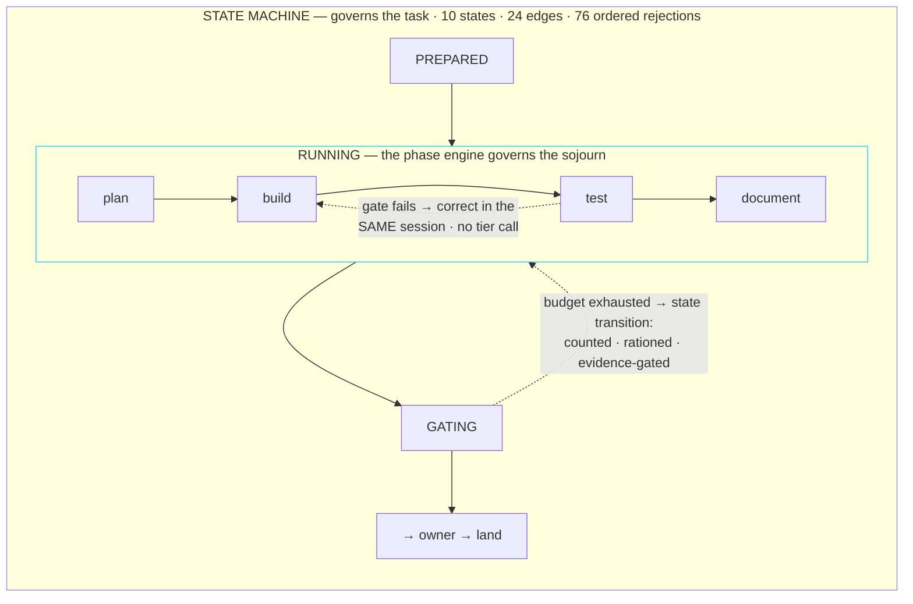
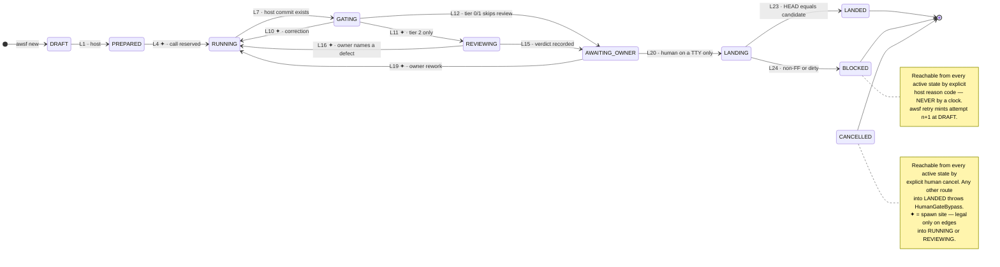

# AWSF — Agentic Workflow Software Factory

A single-operator agentic software factory: a host-owned state machine governs
a task's lifecycle, a typed phase engine governs the work inside each
executing state, and a human is the only path to landed code.

> **Status: pre-alpha, actively under construction.** Nothing in this
> repository executes an agent, a workflow, or a landing yet. What exists
> today is a validated configuration layer and a scaffolded workspace. See
> [Status](#status) below for exactly what is and isn't real. Every claim in
> this README is backed by a command you can run yourself — see
> [Verifying these claims](#verifying-these-claims).

## What this is

AWSF fuses two systems that each solved the problem the other ignored:

- **`my-agentic-workflow` (MAW)** owns the *task lifecycle* — guarded state
  transitions, a PID-before-spawn barrier that makes hidden processes
  structurally impossible, and a human-only landing edge. It has no idea what
  happens *inside* a running task.
- **`super-simple-software-factory` (SSSF)** owns the *work inside a single
  execution* — typed phases, runtime-validated envelopes, postcondition gates
  with same-session correction loops, and a live SQLite trace. It has no idea
  what a task *is*, and it cannot reach Claude Pro at all.

The fusion is one sentence: **the state machine governs the task; the phase
engine governs the sojourn inside the executing states.** Gate failures
inside a phase are corrected cheaply — re-prompt the same provider session,
context intact, no cost against the task's call budget. Only when a phase's
own correction budget is exhausted does the failure escalate to a *state
transition*, which is expensive, reserved in advance, and rationed by a risk
tier ceiling.



Six pillars carry the design (full detail in the plan's [Solution](specs/awsf-plan.html#solution) section):

1. **Host owns the loop.** No model selects phases, changes risk tier, advances lifecycle state, lands code, or repairs orchestration state.
2. **Journal is truth; SQLite is a rebuildable projection.** Delete the database and `awsf db rebuild` reconstructs it byte-identically.
3. **No process before registration.** The launcher blocks until the journal, status store, and projection all acknowledge a spawned process's identity.
4. **Typed envelopes and earned success.** Every phase starts `FAILED`-equivalent; every agent output is schema-validated at runtime; a green gate records what it verified, not merely that it passed.
5. **Host owns Git; humans own landing.** Agents edit, never commit/merge/push. Landing is local fast-forward only, from an interactive TTY, through a persisted `LANDING` state. No push path exists anywhere in this codebase.
6. **Portability is a contract, not a hope.** One `ProcessSupervisor` port, three platform implementations, one shared contract suite — a port that cannot enumerate survivors errors, it never silently returns `[]`.

### The lifecycle

Ten states, twenty-four legal edges, seventy-six rejected pairs evaluated
against an eleven-step ordered rejection contract. The only path into
`LANDED` passes through a human at a TTY and the persisted `LANDING` state.



This lifecycle is implemented and exhaustively tested: all 24 legal edges,
all 76 rejected pairs, and the ordered rejection contract are green. The
owner CLI now supplies the persisted, TTY-only L20/L23/L24 landing path.

## Status

This project is built one bounded task at a time, by one agent session per
task, against [`specs/awsf-plan.html`](specs/awsf-plan.html) — the plan is
the single source of truth for what's done, and its `[x]` / `[wip]` / `[]`
markers are earned, never pre-declared. As of this README:

| Milestone | State | What it covers |
|---|---|---|
| **M0** — PlanF3 (this document) | `[x]` | Architecture accepted, plan authored, all nine Questionables resolved by the owner |
| **M1** — Contracts & State | `[x]` | Workspace, config and envelope contracts, exhaustive lifecycle and phase machines |
| **M2** — Durable Persistence | `[x]` | Journal, status store, SQLite projector, crash-recovery/rebuild |
| **M3** — Execution Kernel ⚠ | `[x]` | Process supervision, the PID-before-spawn barrier, call-budget reservations |
| **M4** — Real Adapters | `[x]` | `claude-code`, `pi-codex` adapters against captured real provider streams |
| **M5** — Workflows & Gates | `[x]` | The six workflows, eleven gates, permissions, and correction loop |
| **M6** — Owner Controls | `[wip]` — T21 done; T22 outstanding | CLI commands, TTY-only persisted landing, cancel, retry; doctor/rebuild/gc next |
| **M7** — API & Dashboard | `[]` | Read-only HTTP API, the Vue dashboard |
| **M8** — Platform & Pilots | `[]` | Cross-platform verification, two real pilot tasks |

**Concretely, right now:** the lifecycle, persistence, execution kernel,
adapters, workflows, gates, permissions, and owner CLI are implemented. The
CLI exposes `new`, `start`, `status`, `watch`, `land`, `cancel`, and `retry`;
landing has one human+TTY authorization site and mutates the canonical checkout
only by a verified local fast-forward. The read-only operator commands, API,
dashboard, platform matrix, and pilots remain outstanding.

## Verifying these claims

Every status claim above is backed by a command, not an assertion:

```bash
npm install
npm test              # unit + contract + simulation + zero-quota journeys
npm run lint          # oxlint over core/ and dashboard/
npm run typecheck     # known missing-Node-declarations gap; see plan Amendments
npm run awsf -- status <task-id>
```

Do not take a green unit suite as evidence about process trees or Git landing:
`npm test` runs all four layers. The journey suite is fixture-backed and spends
no provider quota.

## Repository layout

Two npm workspaces, so the dependency allowlist below is mechanically
checkable per workspace (`core/test/unit/meta/dependency-allowlist.test.ts`).
There is deliberately no `orchestrator/` directory — a CLI calls a workflow
that opens phases; naming a directory "orchestrator" is how one grows back.

```
awsf.config.yaml          the only committed tuning surface — validated by core/src/config/
AGENTS.md                 invariants an agent session working ON this repo must not break
specs/                    the planning artifacts — read these first
  awsf-plan.html             the build plan: milestones, tasks, and every architectural table
  awsf-architecture-proposal.md   the accepted design authority the plan implements
  awsf-plan-build-prompts.md      one self-contained prompt per milestone/task
  awsf-plan-acceptance.md         every claim mapped to the mechanism that proves it
core/                     @awsf/core — the host: state machine, adapters, gates, persistence, API
  src/config/                awsf/v1 schema, loader, redacted effective-config snapshot   (built)
  src/{state,contracts,workflow,gates,git,policy,persistence,observability,execution,adapters,cli}/
                              implemented host boundaries through T21
  src/api/                    reserved for the read-only M7 server
  test/{unit,contract,simulation,journeys}/
                              four executable proof layers
dashboard/                Vue 3 + Vite, loopback-only, cursor-polling — not started (M7)
prompts/<agent>/          system.md / user.md pairs per agent, referenced by awsf.config.yaml
justfile                  thin wrappers over the npm scripts — never a second source of truth
```

## Configuration

`awsf.config.yaml` at the repository root is the only committed tuning
surface — adapters, routing, the per-agent Model·Prompt·Harness·Tools dial,
workflows, gates, risk tiers, policy, observability, and pricing. It is
validated against the `awsf/v1` TypeBox schema in `core/src/config/schema.ts`
by the loader in `core/src/config/load.ts`, which hard-rejects:

- any absolute machine path (POSIX, Windows drive-letter, UNC, or `~`) —
  this file is "durable intent," committed and versioned forever, and must
  never encode where anything lives on any one machine
- any credential-shaped value
- adapter, workflow, or gate identifiers outside the known set
- a risk-tier call ceiling that isn't `{1, 3, 5}`
- `routing.no_fallback` set to anything but `true`
- `observability.persist_thinking_text` set to anything but `false` — model
  reasoning is streamed for live display and never persisted

`core/src/config/effective-config.ts` produces the redacted snapshot that
will back the API/UI and the `sessions.config_snapshot_json` column, with a
defense-in-depth redaction pass on top of what the loader already guarantees.

## Portability

One row per platform-dependent behaviour, one column per platform. Every
cell starts `PENDING` and may only be filled with evidence produced *on the
machine the column names* — a passing Linux suite is not evidence about
Darwin. This table is reproduced verbatim from the plan's own
[Portability Matrix](specs/awsf-plan.html#portability); **the filled matrix,
with per-cell dates and command output, is the only artifact allowed to back
a portability claim, and this README will not get ahead of it.**

| Behaviour | Linux | macOS | Windows-native | WSL2 |
|---|---|---|---|---|
| State root resolution | PENDING | PENDING | PENDING | PENDING |
| Process-group enumeration (survivors) | PENDING | PENDING | PENDING | PENDING |
| Tree cancellation (TERM → grace → KILL → report) | PENDING | PENDING | PENDING | PENDING |
| Launcher barrier (register → GO → exec/resume) | PENDING | PENDING | PENDING | PENDING |
| Sandbox broker (bwrap / Seatbelt / none) | PENDING | PENDING | N/A — `unavailable` shown | PENDING |
| Worktree containment on case-insensitive filesystems | PENDING | PENDING (APFS default) | PENDING (NTFS) | PENDING (drvfs) |
| Provider CLI launch (`claude`, `pi`, `agy`) | PENDING | PENDING | PENDING | PENDING |
| TTY detection for `awsf land` | PENDING | PENDING | PENDING | PENDING |
| Installed-vs-portable consistency | PENDING | PENDING | PENDING | PENDING |
| `node:sqlite` feature probe (WAL, STRICT, json_valid) | PENDING | PENDING | PENDING | PENDING |
| Write-capable workflows end-to-end | PENDING | PENDING | BLOCKED by design (v1 routes through WSL2) | PENDING |

This repository has so far only ever been touched from WSL2/Linux.

## Governance

[`AGENTS.md`](AGENTS.md) lists the invariants any agent session working *on*
this repository — not workflows AWSF will eventually *run* — must not break:
no `node:child_process` outside the transport broker, no `shell: true`
anywhere, no SQLite writer outside the projector and its migrations, no
credential-shaped value committed anywhere, no commit that names an agent as
author, committer, co-author, or collaborator, and no status marker flipped
for work a session didn't actually complete. Several are mechanically
enforced by the meta-test suite under `core/test/unit/meta/`.

## Planning artifacts

- [`specs/awsf-plan.html`](specs/awsf-plan.html) — the build plan: every
  milestone, task, architectural table, and Q&A. This is a static HTML file
  with inline Mermaid diagrams; GitHub will show it as source, so clone the
  repo and open it in a browser to read it as intended.
- [`specs/awsf-architecture-proposal.md`](specs/awsf-architecture-proposal.md) —
  the accepted design authority the plan above implements; every decision in
  it is settled, not open for re-litigation by a build session.
- [`specs/awsf-plan-build-prompts.md`](specs/awsf-plan-build-prompts.md) —
  one self-contained prompt per milestone and per task, for driving a fresh
  agent session against a bounded piece of work.
- [`specs/awsf-plan-acceptance.md`](specs/awsf-plan-acceptance.md) — every
  claim this project makes, mapped to the exact mechanism that proves it.

## License and attribution

This repository is currently private with no license file; that is an
explicit choice left to the owner, not an oversight. Its design draws on
`super-simple-software-factory` (an external, MIT-licensed © 2026 IndyDevDan
project — see [`specs/awsf-architecture-proposal.md`](specs/awsf-architecture-proposal.md)
for the full read-only audit this project's design is built on): where SSSF
code is carried literally (stream framing, visualizer patterns), the
receiving file carries its own MIT attribution header; where only a pattern
is reused, the plan's own citations are the record.
