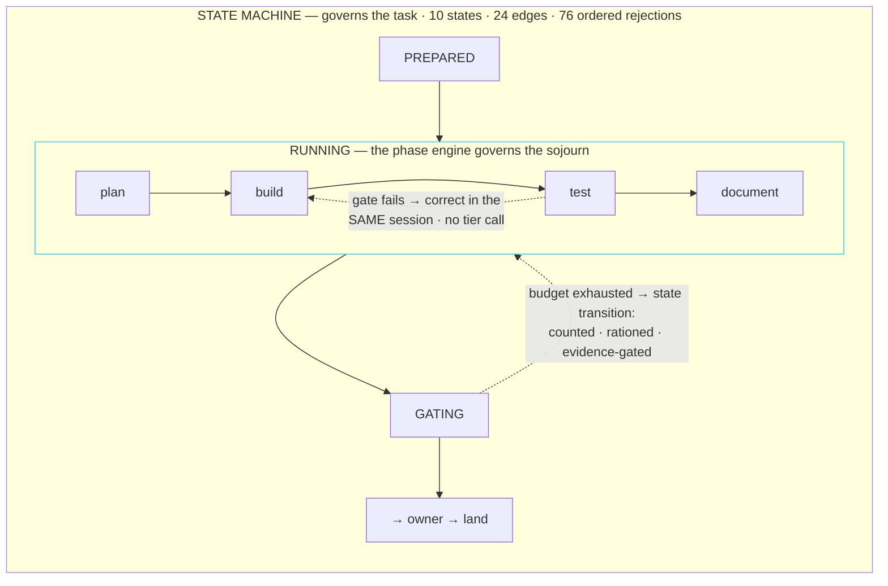
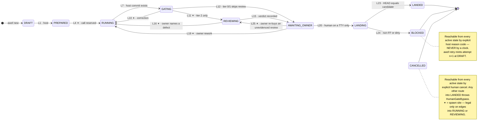

# AWSF — Agentic Workflow Software Factory

A single-operator agentic software factory: a host-owned state machine governs
a task's lifecycle, a typed phase engine governs the work inside each
executing state, and a human is the only path to landed code.

> **Status: pre-alpha, actively under construction.** The T1 `build` and
> `plan-build-test` workflows now have a production runner; T2 production review
> and both adoption pilots remain outstanding. See [Status](#status) below for
> exactly what is and isn't real. Every claim in this README is backed by a
> command you can run yourself — see [Verifying these claims](#verifying-these-claims).

## What this is

AWSF fuses two systems that each solved the problem the other ignored:

- **`my-agentic-workflow` (MAW)** owns the *task lifecycle* — guarded state
  transitions, a PID-before-spawn barrier that makes hidden processes
  structurally impossible, and a human-only landing edge. It has no idea what
  happens *inside* a running task.
- **`super-simple-software-factory` (SSSF)** owns the *work inside a single
  execution* — typed phases, runtime-validated envelopes, postcondition gates
  with same-session correction loops, and a live SQLite trace. It has no idea
  what a task *is*, and it cannot reach Claude Pro at all.

The fusion is one sentence: **the state machine governs the task; the phase
engine governs the sojourn inside the executing states.** Gate failures
inside a phase are corrected cheaply — re-prompt the same provider session,
context intact, no cost against the task's call budget. Only when a phase's
own correction budget is exhausted does the failure escalate to a *state
transition*, which is expensive, reserved in advance, and rationed by a risk
tier ceiling.



Six pillars carry the design (full detail in the plan's [Solution](specs/awsf-plan.html#solution) section):

1. **Host owns the loop.** No model selects phases, changes risk tier, advances lifecycle state, lands code, or repairs orchestration state.
2. **Journal is truth; SQLite is a rebuildable projection.** Delete the database and `awsf db rebuild` reconstructs it byte-identically.
3. **No process before registration.** The launcher blocks until the journal, status store, and projection all acknowledge a spawned process's identity.
4. **Typed envelopes and earned success.** Every phase starts `FAILED`-equivalent; every agent output is schema-validated at runtime; a green gate records what it verified, not merely that it passed.
5. **Host owns Git; humans own landing.** Agents edit, never commit/merge/push. Landing is local fast-forward only, from an interactive TTY, through a persisted `LANDING` state. No push path exists anywhere in this codebase.
6. **Portability is a contract, not a hope.** One `ProcessSupervisor` port, three platform implementations, one shared contract suite — a port that cannot enumerate survivors errors, it never silently returns `[]`.

### The lifecycle

Ten states, twenty-five legal edges, seventy-five rejected pairs evaluated
against an eleven-step ordered rejection contract. The only path into
`LANDED` passes through a human at a TTY and the persisted `LANDING` state.



This lifecycle is implemented and exhaustively tested: all 25 legal edges,
all 75 rejected pairs, and the ordered rejection contract are green. The
owner CLI supplies the interactive L19 `awsf rework TASK "<concrete defect>"`
path, the interactive L25
`awsf review TASK --reason "<why the recorded review is not evidence>"` path,
and the persisted, TTY-only L20/L23/L24 landing path.

## Status

This project is built one bounded task at a time, by one agent session per
task, against [`specs/awsf-plan.html`](specs/awsf-plan.html) — the plan is
the single source of truth for what's done, and its `[x]` / `[wip]` / `[]`
markers are earned, never pre-declared. As of this README:

| Milestone | State | What it covers |
|---|---|---|
| **M0** — PlanF3 (this document) | `[x]` | Architecture accepted, plan authored, all nine Questionables resolved by the owner |
| **M1** — Contracts & State | `[x]` | Workspace, config and envelope contracts, exhaustive lifecycle and phase machines |
| **M2** — Durable Persistence | `[x]` | Journal, status store, SQLite projector, crash-recovery/rebuild |
| **M3** — Execution Kernel ⚠ | `[x]` | Process supervision, the PID-before-spawn barrier, call-budget reservations |
| **M4** — Real Adapters | `[x]` | `claude-code`, `pi-codex` adapters against captured real provider streams |
| **M5** — Workflows & Gates | `[x]` | The six workflows, thirteen gates, permissions, and correction loop |
| **M6** — Owner Controls | `[x]` | CLI commands, TTY-only persisted landing, cancel, retry, doctor, rebuild, and list-only gc |
| **M7** — API & Dashboard | `[x]` | Read-only HTTP API and the loopback Vue dashboard |
| **M8** — Platform & Pilots | `[x]` | WSL2 matrix evidence and explicit destination-machine deferrals; both pilot tasks landed — see `records/pilots/` |

**Concretely, right now:** the lifecycle, persistence, execution kernel,
adapters, workflows, gates, permissions, owner CLI, and read-only dashboard are
implemented. `awsf run TASK` drives configured `build` and `plan-build-test` at
T1 and `build-review` and `simple-sdlc` at T2 from `PREPARED`; at
`AWAITING_OWNER`, `awsf rework TASK "<concrete defect>"`
uses the same configured writable builder route for one fresh L19 call, creates
a new host-owned candidate on the prior candidate, and reruns fresh gates.
Rework stays T1-only on purpose: it re-runs one builder phase, and the candidate
that produces has not been reviewed, so a T2 attempt is told to cancel and
`awsf retry TASK` — which re-runs the whole workflow, review included, carrying
the spend forward. `awsf review TASK --reason "..."` is the T2 counterpart and
the opposite trade: it changes no tree, so it preserves and revalidates the
green rather than invalidating it.
Unsupported production recipes and any configured continuity that disagrees
with the selected adapter's verified capability fail closed before launch. The
explicit `awsf run TASK --stub true` simple-SDLC
demonstration is unchanged.
A T2 run reaches the owner only through `REVIEWING`: the review provider is
resolved by exclusion from the worker's, a configuration that disagrees is
refused before any call is spent, and an unreachable reviewer blocks after one
transport retry rather than substituting. The reviewer is read-only over the
worktree and is handed host-composed evidence — the owner's request and
acceptance criteria, the exact base and candidate SHAs, the Git-observed
changed-file list, a bounded whole-hunk diff with the digest of the full one,
and the complete command results — because a review that saw nothing is not a
review; `review_evidence_present` refuses evidence that could not be evidence
before the call is spent, and refuses the phase whose prompt did not carry it.
A review that was recorded *without* that evidence — every review produced
before the gate existed — can be replaced once, at one call, without rebuilding
the candidate:
`awsf review TASK --reason "<why the recorded review is not evidence>"`
takes L25 at a TTY, revalidates the candidate three times, runs a cold reviewer
on the opposite provider, and writes its artifacts under `reviewer-re<N>` so the
review it supersedes is retained unchanged. Eligibility is host-determined
rather than discretionary: a review carrying a *passing* `review_evidence_present`
row is not replaceable at all, so disliking a verdict cannot buy a second
opinion. It draws the same one-per-attempt owner re-entry allowance as rework,
refuses unless the tier ceiling has two calls of headroom, and says in plain
words at the confirmation prompt that a failed replacement costs the candidate.

When *that* is what an attempt runs out of, the ceiling is a checkpoint the
owner can pass rather than a cap that strands the work:
`awsf raise TASK --calls N --reason "<why this task is worth more calls>"`
grants one named task more calls while its attempt is live, at a TTY, with the
grant and the reason written to the journal. It is deliberately a command and
not a configuration edit — an attempt is compared against the configuration
snapshot it recorded before `rework` and `review`, so editing `awsf.config.yaml`
mid-attempt would lock the owner out of the very acts the raise was for. The
grant is bounded (`MAX_GRANT_CALLS` per act, `MAX_CALL_CEILING` in total),
task-scoped (it widens nothing else), carried forward by `awsf retry` alongside
the spend it paid for, and refused outright to a piped stdin.

The owner then records the end-user
journey with `awsf journey TASK --journey ID --sha REVISION` at a TTY — the
`journey_passes` gate checks separately that it ran, that it passed, and that
the revision is the exact candidate — and only then may land. Landing has one
human+TTY authorization
site and mutates the canonical checkout only by a verified local fast-forward.
The portability matrix is evidence-backed only where it says so; the two real
pilots remain outstanding.

## Install and usage

AWSF runs from a checked-out repository on Node 22.12 or newer:

```bash
npm install
npm test
npm run awsf -- doctor
npm run awsf -- db rebuild
```

Drive a configured T1 workflow, with landing performed only by the owner at an
interactive terminal:

```bash
npm run awsf -- new T01 "describe the task" --workflow build --tier 1
npm run awsf -- start T01
npm run awsf -- run T01
npm run awsf -- status T01
# If inspection finds a concrete defect:
npm run awsf -- rework T01 "remove the duplicate whitespace in core/src/generated.ts"
npm run awsf -- land T01
```

The explicit zero-quota fixture demonstration remains available:

```bash
npm run awsf -- new T01-fixture "describe the task" --workflow simple-sdlc --tier 1
npm run awsf -- start T01-fixture --stub true
npm run awsf -- run T01-fixture --stub true
```

The [`justfile`](justfile) is optional convenience only; each target delegates
to a root npm script. For example, `just test`, `just lint`, and
`just awsf doctor` are equivalent wrappers. Build the dashboard before serving
it with `npm run dash:build`, then run `npm run awsf -- dash`.

## Verifying these claims

Every status claim above is backed by a command, not an assertion:

```bash
npm install
npm test              # unit + contract + simulation + zero-quota journeys
npm run lint          # oxlint over core/ and dashboard/
npm run typecheck     # known missing-Node-declarations gap; see plan Amendments
npm run awsf -- status <task-id>
npm run awsf -- doctor
npm run awsf -- db rebuild
```

Do not take a green unit suite as evidence about process trees or Git landing:
`npm test` runs all four layers. The journey suite is fixture-backed and spends
no provider quota.

## Repository layout

Two npm workspaces, so the dependency allowlist below is mechanically
checkable per workspace (`core/test/unit/meta/dependency-allowlist.test.ts`).
There is deliberately no `orchestrator/` directory — a CLI calls a workflow
that opens phases; naming a directory "orchestrator" is how one grows back.

```
awsf.config.yaml          the only committed tuning surface — validated by core/src/config/
AGENTS.md                 invariants an agent session working ON this repo must not break
specs/                    the planning artifacts — read these first
  awsf-plan.html             the build plan: milestones, tasks, and every architectural table
  awsf-architecture-proposal.md   the accepted design authority the plan implements
  awsf-plan-build-prompts.md      one self-contained prompt per milestone/task
  awsf-plan-acceptance.md         every claim mapped to the mechanism that proves it
core/                     @awsf/core — the host: state machine, adapters, gates, persistence, API
  src/config/                awsf/v1 schema, loader, redacted effective-config snapshot   (built)
  src/{state,contracts,workflow,gates,git,policy,persistence,observability,execution,adapters,cli}/
                              implemented host boundaries and the T1 production runner
  src/api/                    read-only M7 server
  test/{unit,contract,simulation,journeys}/
                              four executable proof layers
dashboard/                Vue 3 + Vite, loopback-only, cursor-polling dashboard
prompts/<agent>/          system.md / user.md pairs per agent, referenced by awsf.config.yaml
justfile                  thin wrappers over the npm scripts — never a second source of truth
```

## Configuration

`awsf.config.yaml` at the repository root is the only committed tuning
surface — adapters, routing, the per-agent Model·Prompt·Harness·Tools dial,
workflows, gates, risk tiers, policy, observability, and pricing. Runtime
`seed_paths` are normalized repository-relative paths only: after creating a
detached worktree, `awsf start` copies each present Git-ignored seed from the
canonical repository into the same worktree-relative location. This is local
provisioning, never installation or a network action; this repository seeds
`node_modules` so host gates run with project dependencies isolated from the
canonical checkout. Agent `thinking: xhigh` is valid shared vocabulary, but
each selected adapter must represent it exactly or reject the descriptor; no
adapter may floor it to `high`. It is
validated against the `awsf/v1` TypeBox schema in `core/src/config/schema.ts`
by the loader in `core/src/config/load.ts`, which hard-rejects:

- any absolute machine path (POSIX, Windows drive-letter, UNC, or `~`) —
  this file is "durable intent," committed and versioned forever, and must
  never encode where anything lives on any one machine
- any credential-shaped value
- traversal, ambiguous separators, overlap, or absolute machine paths in
  `runtime.seed_paths`; start also refuses missing, tracked/non-ignored,
  protected, already-present, unsupported, or escaping-link seed material
- adapter, workflow, or gate identifiers outside the known set (`lint` is a
  configured host gate; candidate whitespace hygiene is immutable and is not)
- a risk-tier call ceiling that is not a whole number of calls inside the
  bound in `core/src/state/tiers.ts` — `risk.call_ceiling` is a real dial
  (defaults `{T0: 1, T1: 3, T2: 5}`), and the bound is in code because a
  bound the config could raise would be a bound the config could remove
- `routing.no_fallback` set to anything but `true`
- `observability.persist_thinking_text` set to anything but `false` — model
  reasoning is streamed for live display and never persisted

`core/src/config/effective-config.ts` produces the redacted snapshot that
backs the API/UI and the `sessions.config_snapshot_json` column, with a
defense-in-depth redaction pass on top of what the loader already guarantees.
`awsf retry` snapshots the currently loaded effective configuration and
correction allowance into attempt n+1 while preserving task-lifetime call spend;
it never carries the prior attempt's gate snapshot into execution under a new
configuration. Every candidate also passes the non-configurable
`candidate_hygiene` gate (`git diff --check base..candidate`) before any
configured host command can authorize the owner gate.

## Portability

Every cell may only be filled with evidence produced *on the machine the
column names* — a passing Linux suite is not evidence about Darwin. Status is
not duplicated here: the plan's [Portability Matrix](specs/awsf-plan.html#portability)
is the sole authoritative table, including per-cell dates, deferrals, and the
command output behind each claim.

| Destination machine | Authoritative status and evidence |
|---|---|
| Linux desktop | [Portability Matrix](specs/awsf-plan.html#portability) |
| M5 MacBook Pro (macOS) | [Portability Matrix](specs/awsf-plan.html#portability) |
| Windows-native (dashboard/read-only only) | [Portability Matrix](specs/awsf-plan.html#portability) |
| WSL2 development machine | [Portability Matrix](specs/awsf-plan.html#portability) |

No native-Windows write parity is claimed.

## Governance

[`AGENTS.md`](AGENTS.md) lists the invariants any agent session working *on*
this repository — not workflows AWSF will eventually *run* — must not break:
no `node:child_process` outside the transport broker, no `shell: true`
anywhere, no SQLite writer outside the projector and its migrations, no
credential-shaped value committed anywhere, no commit that names an agent as
author, committer, co-author, or collaborator, and no status marker flipped
for work a session didn't actually complete. Several are mechanically
enforced by the meta-test suite under `core/test/unit/meta/`.

## Planning artifacts

- [`specs/awsf-plan.html`](specs/awsf-plan.html) — the build plan: every
  milestone, task, architectural table, and Q&A. This is a static HTML file
  with inline Mermaid diagrams; GitHub will show it as source, so clone the
  repo and open it in a browser to read it as intended.
- [`specs/awsf-architecture-proposal.md`](specs/awsf-architecture-proposal.md) —
  the accepted design authority the plan above implements; every decision in
  it is settled, not open for re-litigation by a build session.
- [`specs/awsf-plan-build-prompts.md`](specs/awsf-plan-build-prompts.md) —
  one self-contained prompt per milestone and per task, for driving a fresh
  agent session against a bounded piece of work.
- [`specs/awsf-plan-acceptance.md`](specs/awsf-plan-acceptance.md) — every
  claim this project makes, mapped to the exact mechanism that proves it.

## License and attribution

This repository is currently private with no license file; that is an
explicit choice left to the owner, not an oversight. Its design draws on
`super-simple-software-factory` (an external, MIT-licensed © 2026 IndyDevDan
project — see [`specs/awsf-architecture-proposal.md`](specs/awsf-architecture-proposal.md)
for the full read-only audit this project's design is built on): where SSSF
code is carried literally (stream framing, visualizer patterns), the
receiving file carries its own MIT attribution header; where only a pattern
is reused, the plan's own citations are the record.
